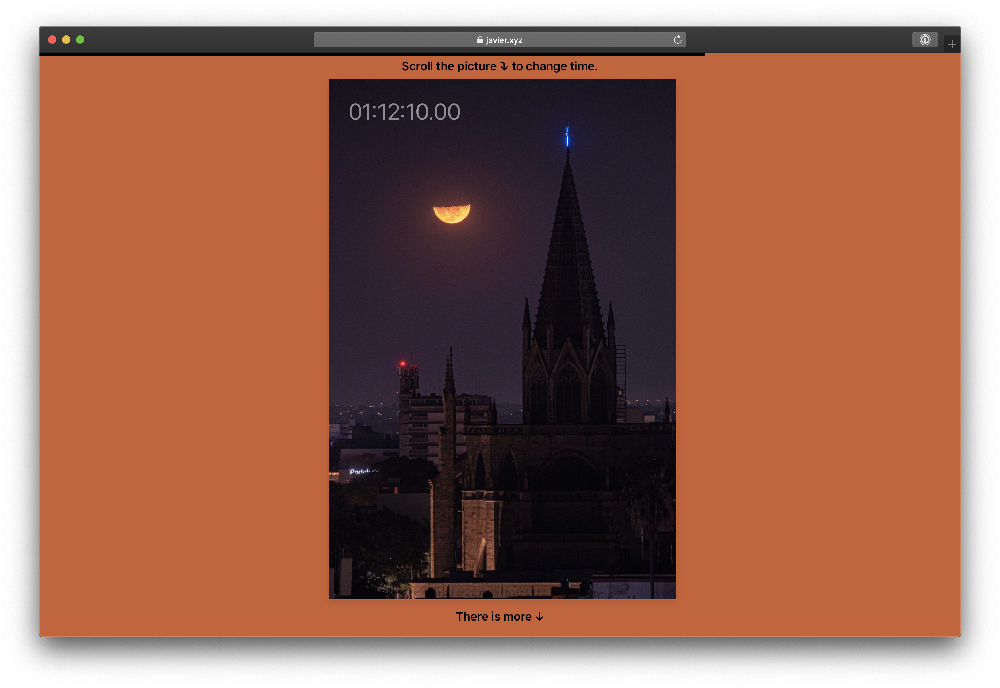

# Timelapses
I love to make timelapses. There is something special about seeing something transform as the day goes. I made this website to share some of my favourite timelapses in a way in which is it easy to see how everything changes through the day, but also easy to stop and see only one picture at any given time. Hope you enjoy!

If you want to make your own you can fork this repo, the `main.js` file contains configuration objects that should be easy to update. More documentation and examples to come soon.

Sequencer lib 
https://github.com/ertdfgcvb/Sequencer

